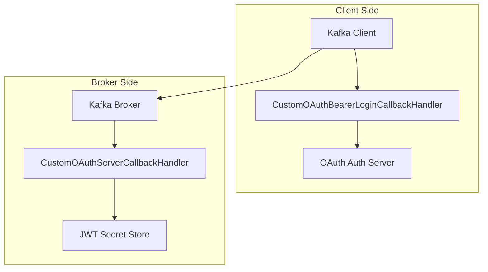
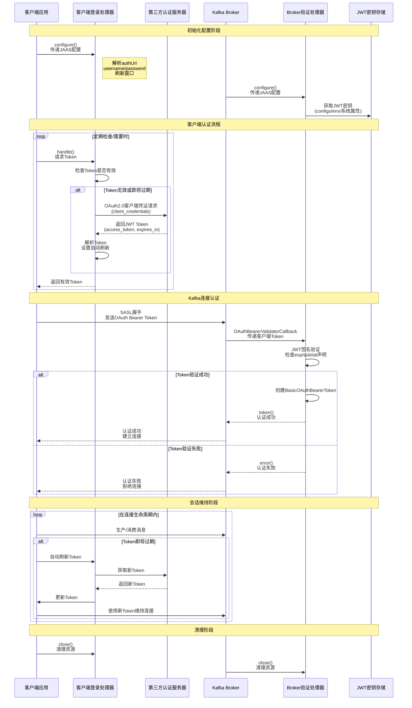

# SASL OAUTHBEARER 认证机制

本文档详细介绍了 Kafka 中基于 OAuth 2.0 的 SASL OAUTHBEARER 认证机制，包括其工作原理、配置方法、实现细节以及最佳实践。

---

## 架构设计



- CustomOAuthBearerLoginCallbackHandler:位于客户端，获取和刷新 OAuth Token
- CustomOAuthServerCallbackHandler:位于Broker 端，验证 OAuth Token	
- OAuth 认证服务器:外部服务，颁发 JWT Token
- JWT 密钥存储:配置文件/环境变量，存储签名密钥	

---

## 核心实现

### 客户端认证流程

1. 配置阶段：客户端配置 OAuth 登录处理器和认证服务器信息
2. Token 获取：客户端从第三方认证服务器获取 JWT Token
3. 自动刷新：客户端在 Token 过期前自动刷新
4. 连接认证：客户端使用 Token 连接 Kafka Broker

### 服务端验证流程

1. 配置阶段：Broker 配置 OAuth 验证处理器和 JWT 密钥
2. Token 验证：Broker 验证客户端传入的 Token 签名和声明
3. 认证决策：根据验证结果允许或拒绝连接
4. 会话维持：在 Token 有效期内维持客户端连接

### 整体交互流程


### 代码实现

- xxx todo:github link 

---

## 从SASL_PLAIN切换到SASL_OAUTHBEARER

### Broker端

在`/etc/kafka/server.properties`文件新增配置

```properties
# 启用 SASL_SSL 监听器
listeners=SASL_SSL://公网IP（域名）:9889
security.inter.broker.protocol=SASL_SSL
sasl.mechanism.inter.broker.protocol=PLAIN
# 全局的sasl.enabled.mechanisms
sasl.enabled.mechanisms=PLAIN,OAUTHBEARER

# 配置 OAuth 处理器
listener.name.sasl_ssl.oauthbearer.sasl.server.callback.handler.class=huidong.yin.kafkasasloauth.server.CustomOAuthServerCallbackHandler
# JAAS 配置 - 引用密钥名称
listener.name.sasl_ssl.oauthbearer.sasl.jaas.config=org.apache.kafka.common.security.oauthbearer.OAuthBearerLoginModule required secretKeyName="kafka.sasl.oauth.secret";

# 实际密钥值（在配置文件中）
kafka.sasl.oauth.secret=your-super-secure-jwt-secret-key-here
```

将当前项目打包后生成的jar`kafka-sasl-oauth-1.0.0.jar`放入到`/usr/local/kafka4/libs/`目录下，重新启动Kafka。

### Client端

客户端初始化时添加配置：

```java
    static {
        Properties props = new Properties();
        props.put("bootstrap.servers", "kafka-broker:9889");
        props.put("security.protocol", "SASL_SSL");
        props.put("sasl.mechanism", "OAUTHBEARER");

        // 使用自定义 OAuth 登录处理器
        props.put("sasl.login.callback.handler.class",
                CustomOAuthBearerLoginCallbackHandler.class.getName());

        // JAAS 配置 - 包含认证服务器信息
        props.put("sasl.jaas.config",
                "org.apache.kafka.common.security.oauthbearer.OAuthBearerLoginModule required " +
                        "authUrl=\"https://auth-server.com/oauth/token\" " +
                        "username=\"your-client-id\" " +
                        "password=\"your-client-secret\" " +
                        "refreshWindowSeconds=\"60\";");
        
    }
```

---


